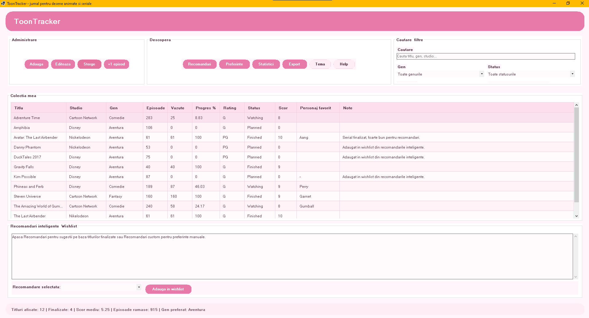

# ToonTracker

ToonTracker este o aplicație desktop realizată în C# Windows Forms, destinată gestionării desenelor animate și serialelor animate urmărite de utilizator.

Aplicația permite adăugarea, editarea, ștergerea și urmărirea progresului pentru diferite titluri animate. Proiectul include și un sistem de recomandări inteligente, statistici vizuale, export de raport și mai multe teme vizuale.

## Screenshot interfață

## Funcționalități principale

- Adăugare desene animate și seriale animate.
- Editare informații despre fiecare titlu.
- Ștergere titluri din colecție.
- Marcarea unui episod ca vizionat prin butonul `+1 episod`.
- Actualizarea automată a statusului:
  - `Planned` când nu este vizionat niciun episod;
  - `Watching` când este început;
  - `Finished` când toate episoadele sunt vizionate.
- Căutare după titlu, gen sau studio.
- Filtrare după gen și status.
- Ordonare după:
  - ordine alfabetică;
  - număr de episoade;
  - progres;
  - scor.
- Sistem de recomandări automate pe baza titlurilor finalizate.
- Recomandări personalizate în funcție de preferințele utilizatorului.
- Adăugarea unei recomandări direct în wishlist.
- Statistici vizuale cu grafice pentru:
  - genuri;
  - studiouri;
  - rating;
  - status.
- Export raport în format `.txt` sau `.csv`.
- Teme vizuale:
  - Cozy Pink;
  - Berry Night;
  - Ocean Blue.
- Help asociat aplicației.
- Validări clare pentru datele introduse.

## Tehnologii folosite

- C#
- .NET
- Windows Forms
- Programare orientată pe obiecte
- Pattern Repository
- Strategy Pattern pentru recomandări
- Testare unitară

## Structura proiectului

Proiectul este organizat pe mai multe module:

- `ToonTracker.Domain`  
  Conține clasele de bază ale aplicației, precum modelul pentru un desen sau serial animat.

- `ToonTracker.Data`  
  Conține partea de salvare și citire a datelor.

- `ToonTracker.Services`  
  Conține logica aplicației: adăugare, editare, ștergere, validare, statistici și recomandări.

- `ToonTracker.UI`  
  Conține interfața grafică Windows Forms.

- `ToonTracker.Tests`  
  Conține testele unitare pentru funcționalitățile importante ale aplicației.

## Cum se folosesc recomandările

Aplicația are două tipuri de recomandări:

1. **Recomandări automate**  
   Acestea sunt generate pe baza desenelor sau serialelor finalizate și a scorurilor acordate.

2. **Recomandări personalizate**  
   Utilizatorul poate selecta preferințe precum genuri, studiouri sau tipul serialului, iar aplicația generează sugestii potrivite.

Titlurile recomandate pot fi adăugate direct în wishlist cu statusul `Planned`.

## Validări implementate

Aplicația verifică datele introduse de utilizator pentru a evita informații greșite. Exemple:

- titlul nu poate fi gol;
- genul nu poate fi gol;
- numărul de episoade trebuie să fie pozitiv;
- episoadele vizionate nu pot depăși numărul total de episoade;
- scorul nu poate fi acordat dacă nu a fost vizionat niciun episod;
- nu pot exista două titluri cu același nume.

